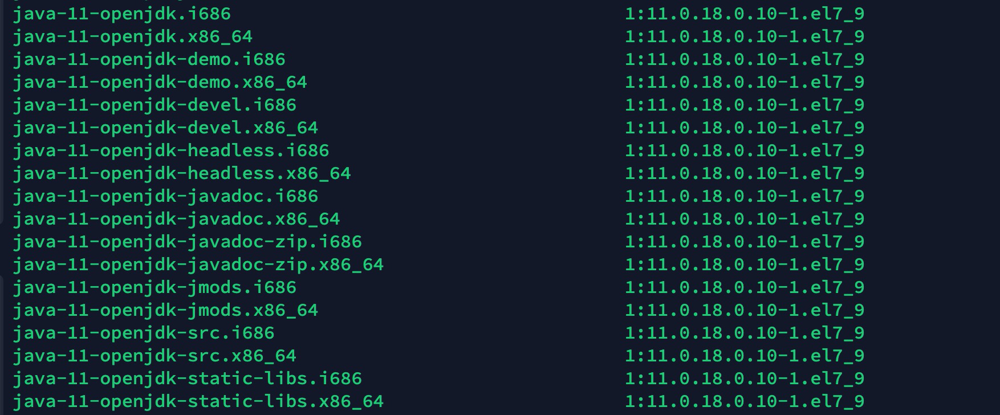
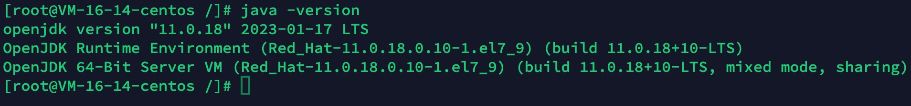
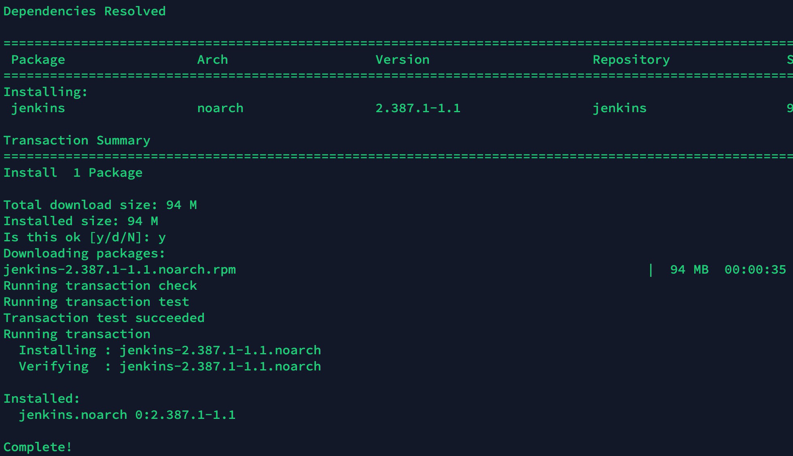
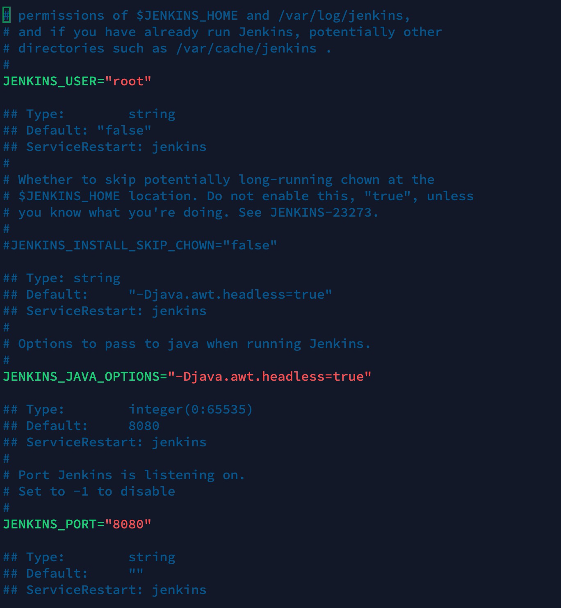
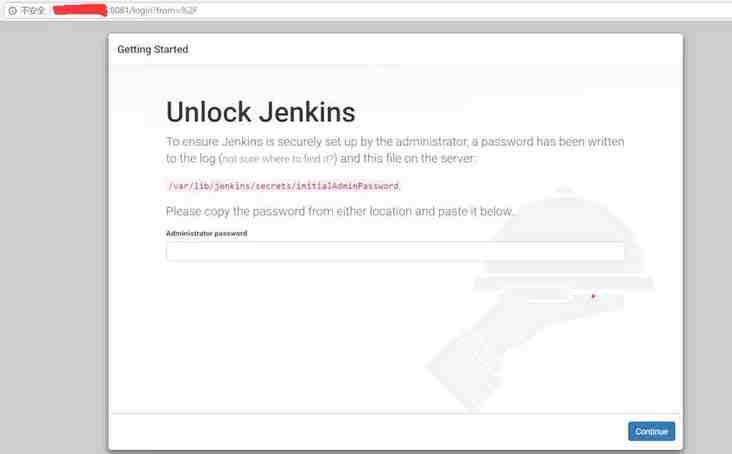
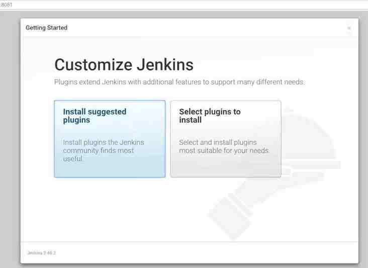
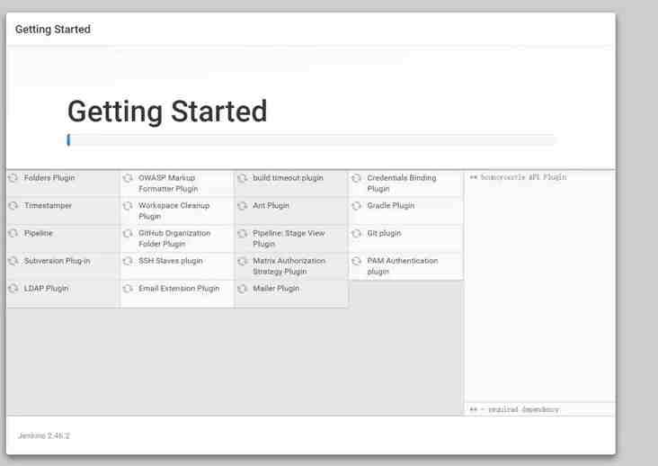
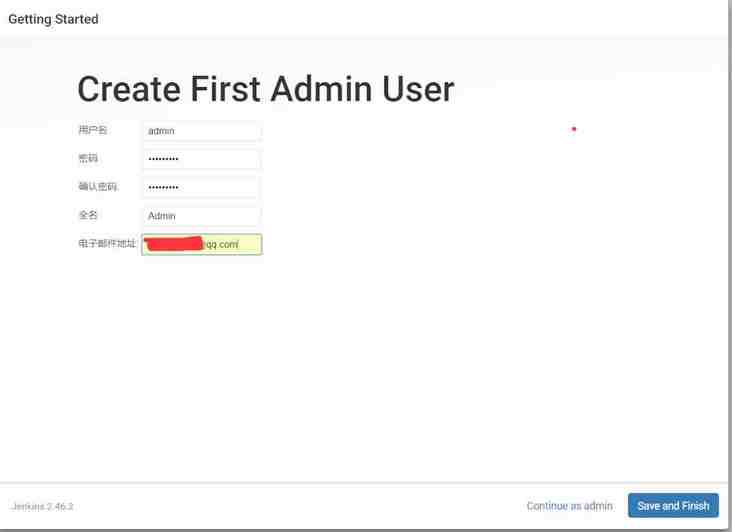
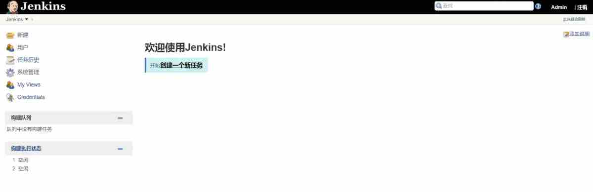

Jenkins是用java编写的开源持续集成工具，目前被国内外各公司广泛使用。本章教大家如何在linux服务器上安装Jenkins。

### 安装jdk

Jenkins的运行需要依赖jdk，所以在安装Jenkins之前我们得先把jdk装上。

1. 执行命令`yum -y list java*`查看可安装java版本。执行成功后可以看见如下的结果



2. 选择一个java版本进行安装，这里我们希望安装java11，因为我们的机器是64位的，所以选择安装java-11-openjdk-devel.x86_64。
   这里有个地方要注意，上图中我用红框圈起来的两个java版本，要选择-devel的安装，因为这个安装的是jdk，而那个不带-devel的安装完了其实是jre。

3. 执行命令`yum install -y java-11-openjdk-devel.x86_6`。执行完后会看见控制台刷出很多输出。
   耐心等待至自动安装完成
4. 输入`java -version`查看已安装的jdk版本，当出现如下输出表示安装成功。



### yum安装Jenkins

这里推荐使用yum方式安装Jenkins，最简单方便。

yum的repos中默认是没有Jenkins的，需要先将Jenkins存储库添加到yum repos。

```shell
sudo wget -O /etc/yum.repos.d/jenkins.repo https://pkg.jenkins.io/redhat-stable/jenkins.repo
sudo rpm --import https://pkg.jenkins.io/redhat-stable/jenkins.io.key
```


yum安装Jenkins

```shell
yum install jenkins
```

随后就可以看到系统开始自动下载安装。
出现提示是否下载的时候输入y并按回车。
耐心等待安装完成。



现在Jenkins已经安装好了，不过启动之前最好稍微修改一下配置。默认情况是Jenkins是使用Jenkins用户启动的，但这个用户目前系统并没有赋予权限，这里我们将启动用户修改为root；另外Jenkins默认端口是8080，这个跟tomcat的默认端口冲突，我们也修改一下默认端口。
输入命令进入Jenkins配置文件

```shell
vi /etc/sysconfig/jenkins
```

在配置文件中很容易找到



此处修改配置

```shell
JENKINS_USER="root"
JENKINS_PORT="8081"
```

修改完配置后，保存退出。
好了，现在配置文件也修改好了，可以启动Jenkins了。
输入启动命令以启动Jenkins服务。

```shell
service jenkins start
```

出现OK表示Jenkins启动成功。
在浏览器输入ip:8081进入Jenkins登录页面。




**Jenkins首次登录**
进入登录页面后，Jenkins提示我们需要输入超级管理员密码进行解锁。根据提示，我们可以在/var/lib/jenkins/secrets/initialAdminPassword文件里找到密码。

输入命令以找到密码。

```shell
tail /var/lib/jenkins/secrets/initialAdminPassword
```

找到解锁密码
找到密码后，复制密码，粘贴到Jenkins解锁页面，点击Continue继续初始化配置。短暂的等待后，进入插件安装页面。



**Jenkins插件安装**
这里我们点击的Install suggested plugins，安装默认插件，当然你也可以点击另一个按钮安装指定的插件。

点击后，页面进入了插件下载安装页面。



**默认插件安装**
耐心等待全部安装完成。安装完成后，页面自动进入了管理员账户注册页面。



管理员账户注册
这个页面大家肯定都不陌生，自己输入信息注册吧。输入完信息点击Save and Finish。

Jenkins安装完成
点击Start using Jenkins，进入Jenkins主页面。

Jenkins
至此，Jenkins安装并初始化完成了，


